Note: This project is still in progress

# Capstone Project
Capstone project ATP betting

# Betting
## How betting works

We just bet on the player where we assume or we are convinced that he will win.
Assume that this player in this match has the odd of *1.1*. If we bet with a wager of 1€ and this player wins the cashout will be 1.1€  `cashout = wager * odd`. Our profit would be 0.1€ `profit = cashout - wager`. If the player loses the cashback would be 0€ and the wager would be lost.

## A small example how odd creation works.

In following cases 1 - 3 player 1 is the favorite and player 2 the underdog. There are several reasons why a player could be the favorite. For the odds only the amount of bets set on the one or the other player until the begining of the match. If more bets are set on the one player the odd will fall and the odd for the opponent will raise. Only the collected wager by the bookmaker can be paid out.

But the bookmaker wants also to make profit, so not all collected wagers will be cashed out after the match equal how the outcome is. He just diminutes the odds a bit for a lower total cashout and makes a profit everytime. The mentioned possible real odds are a rough assumption.

In the first three cases player 1 is more and more the favorite due to the distribution of the betters. In the third case the bookmaker cannot lower the odds. The marginal profit is caused by rounding digits. But if no one would bet on player 2 the odd would be 1.0 because there wouldn't be any money to distribute. Let's have a look in case of 100 gamblers..

**Case 1**

_|Player 1|Player 2|Sum
-|-|-|-
Number of betters|80|20|100
Nominal odd|1.25|5.0|
possible real odd|1.19|3.0|
cashout|95.2|60.0|
bookmakers profit|4.8|40|

**Case 2**

_|Player 1|Player 2|Sum
-|-|-|-
Number of betters|90|10|100
Nominal odd|1.11|10.0|
possible real odd|1.08|5.0|
cashout|97.2|50.0|
bookmakers profit|2.8|50|

**Case 3**

_|Player 1|Player 2|Sum
-|-|-|-
Number of betters|99|1|100
Nominal odd|1.01|100.0|
possible real odd|1.01|10.0|
cashout|99.99|10.0|
bookmakers profit|0.01|90.0|

In this case the wagers are equal distributed, even in this case the bookmaker makes his profit.

**Case 4**

_|Player 1|Player 2|Sum
-|-|-|-
Number of betters|50|50|100
Nominal odd|2.0|2.0|
possible real odd|1.7|1.7|
cashout|85.0|85.0|
bookmakers profit|15.0|15.0|

## Betting the favorite
The odds are the indicator who is the favorite. We could just join the opinion of the mass and bet on the favorite. In this example we bet only on *R. Nadal* who belongs to the best players ever. Let's see what happen... (PS = odds Pinnacle winner/loser,  B365 = odds B365 winner/loser)

Date|Winner	|Loser	|PSW	|PSL	|B365W	|B365L
-|-|-|-|-|-|-
2018-04-20	|Nadal R.	|Thiem D.	|1.18	|5.77	|1.14	|5.5
2018-04-21	|Nadal R.	|Dimitrov G.	|1.07	|11.60	|1.06	|10.0
2018-04-22	|Nadal R.	|Nishikori K.	|1.07	|12.20	|1.05	|11.0
2018-04-25	|Nadal R.	|Carballes Baena R.	|1.01	|29.16	|1.01	|26.0
2018-04-26	|Nadal R.	|Garcia-Lopez G.	|1.01	|29.16	|1.01	|26.0
2018-04-27	|Nadal R.	|Klizan M.	|1.06	|13.30	|1.02	|15.0
2018-04-28	|Nadal R.	|Goffin D.	|1.09	|9.71	|1.05	|11.0
2018-04-29	|Nadal R.	|Tsitsipas S.	|1.06	|13.84	|1.04	|13.0
2018-05-09	|Nadal R.	|Monfils G.	|1.04	|15.92	|1.02	|17.0
2018-05-10	|Nadal R.	|Schwartzman D.	|1.03	|22.73	|1.02	|19.0
**Sum**|Number of bets:|**10**|**10.62**|-|**10.42**|-
**Profit**| | |**0.62**|**+6.2%**|**0.42**|**+4.2%**
**Sum**|with tax 5%| |**10.09**|-|**9.899**|-
**Profit**|with tax 5% | |**0.09**|**+0.9%**|**-0.10**|**-1.0%**
2018-05-11	|Thiem D.	|Nadal R.	|10.67	|1.08	|11.00	|1.05
**Sum**|Number of bets:|**11**|**10.62**|-|**10.42**|-
**Profit**|-|-|**-0.38**|**-3.5%**|**-0.58**|**-5.3%**
**Sum**|with tax 5%| |**10.09**|-|**9.899**|-
**Profit**|with tax 5% | |**-0.91**|**-8.3%**|**-1.1**|**-10.0%**

Now, we were right 10 times out of 11 and the prediction was right in over 90%. But one match destroyed our profit. Nadal lost against Thiem against the estimation (5:7, 3:6). The odds were clearly for Nadal and the time before they played (2018-04-20) Nadal won 6:0, 6:2 so there were not really doubts that he would win once more.

But now start halndle the data...

# Inital data
The initial data was downloaded from [http://tennis-data.co.uk/alldata.php](http://tennis-data.co.uk/alldata.php) and stored in data folder.

It contains ATP-Tennis matches over the last 20 years with among other features:

- Date
- Name of the winner
- Name of the Loser
- ATP-ranks of the players
- Result
- Tournament
- Surface
- Series
- Odds of several bookmakers for the most of matches. (Some bookmakers have more odds others less)
- ...

## Data cleaning
The provided data is not really ready to use. There are several odds of different bookmakers but there is no bookmaker with odds for all matches. We'll keep only the odds of the two bookmakers with least missing values. So we keep the odds of B365 and Pinnacle and all others are dropped. 

Not ranked players are set to 2000. The player names are written in different ways. Tailing whitespaces were stripped but some names had to be corrected especially if there are second names.

(Note: maybe another cleaning would be useful after the feature engineering because there will occur generated NaNs that might make problems in further processing with ML-models. But for the moment ist is sufficient)

# elo-score
The elo-score / elo-rating is a value that describes the performance in the past of the player. It takes into account the wins and losses in the past but also the performance of the opponent. So a success against a strong comtetitor has a larger gain as against a weak opponent. Further information on [Wiki](https://en.wikipedia.org/wiki/Elo_rating_system)

The calculation-method of the elo-score is not unique and the algorithm is empirical with variats. Here is a rather simple implementation of the calculation. The *K-factor* e.g. is set constant to 32, and could be seen as *hyer-parameter*. (Working on that is for the future) 

The function is stored in [Python/elo_features.py](Python/elo_features.py)

It figured out that this feature belongs to the most important ones in this project.

(TODO: Create also Surface-dependant elo-scores for each underground)

# Tax

Due to the fact that I live in Germany I have to take into account that a tax of 5% at each bet has to be paid. This decreases the profitability and rises the benchmark to be reached. I don't know if and how there are similar taxes in other countries, I'll drag it along the code.

For comparability issues we'll bet 1 unit of money whichever currency and I don't think that it matters if it is € or Dollar.

Some bookmakers drop the tax from the initial wager. So the effective wager is only 95 cent we bet with. Some other bookmakers pull off 5% of the cashback in case of win. That dereases the gain more and the difference is another profit of the bookmaker. But there are also bookmakers where the tax is implemented in the odds. I don't know how far in this cases the odds and the profit is lower. I assume that there are not different odds just for one county and it is a mixed calculation over all betters over the world.

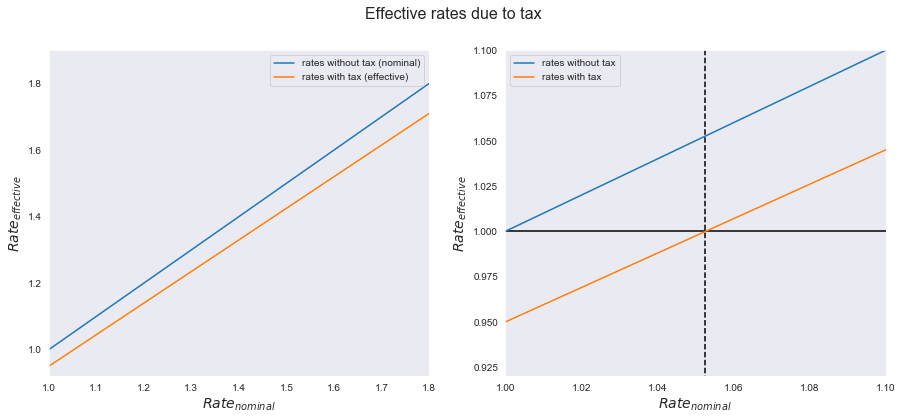

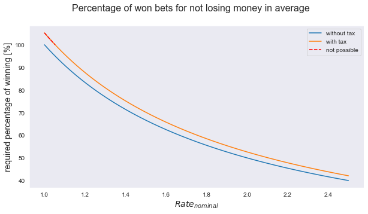

As you can see, the tax matters not only a bit. It distorts straight average strategies. It also disturbs the balance between winning rate, odds, risk and confidence if an outcome appears. There is a threshold of odds / rates for the winning zone because treasury aggrevates the success in betting.

So I would expect that it makes no sense to bet on Nadal due to rather low odds (1.01) even it is nearly obvious that he wins.

Note: I observed that it looks like some bookmakers offer betting with a wager of 50 cent. The deducted tax is "only" 2 cent due to rounding issues. This reduces the tax to 4%. I don't estimate that this fact matter to the way reaching a significant gain.
 

# EDA
So let's have a look on the data we have and try if there is a way to make profit with simple strategies.

How to figure out the better player where we are confident that he wins? And is it worth to bet on him to make money?

## Distribution of outcomes with better elo and rank
Have a look on players that have a better elo-score **AND** a better ATP-ranking.
The following shows if the elo-score or the ATP-rank is suitable for the prediction of the right outcome. It does not consider the ROI.

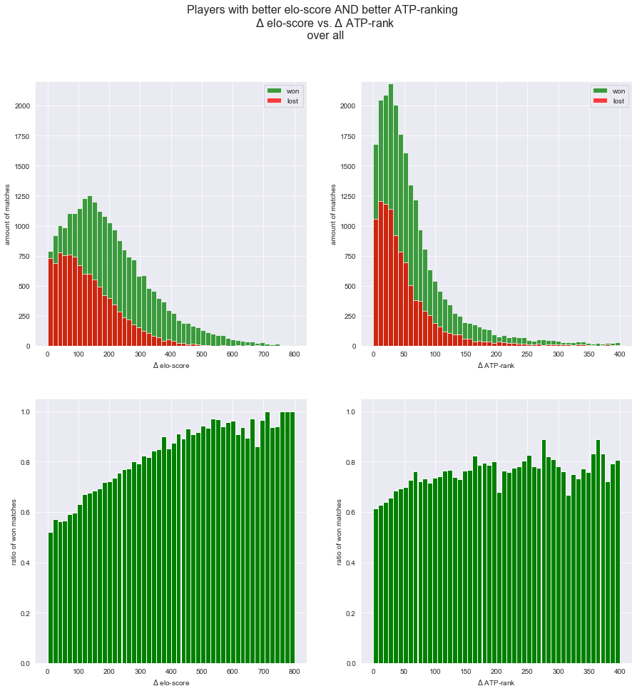

As you see in the figure above the differene of the elo-score promises a bit more chance that the player wins and that the much higher rank in the ATP list. The higher the difference of the elo-score the higher the probability to win. But according to this fact the odds will also fall towards the winner and the amount of such matches falls. 

On the one hand we could say, "So what..." let's bet just on the few nearly sure matches, just pick the matches above $\Delta$-elo 400, but on the other hand we have to keep in mind in our case the tax and the needed ratio of wins at all.

Let's see next if we want a minimum of odds. At least 1.06 for the tax and further 0.02 for our deposit, so 1.08.

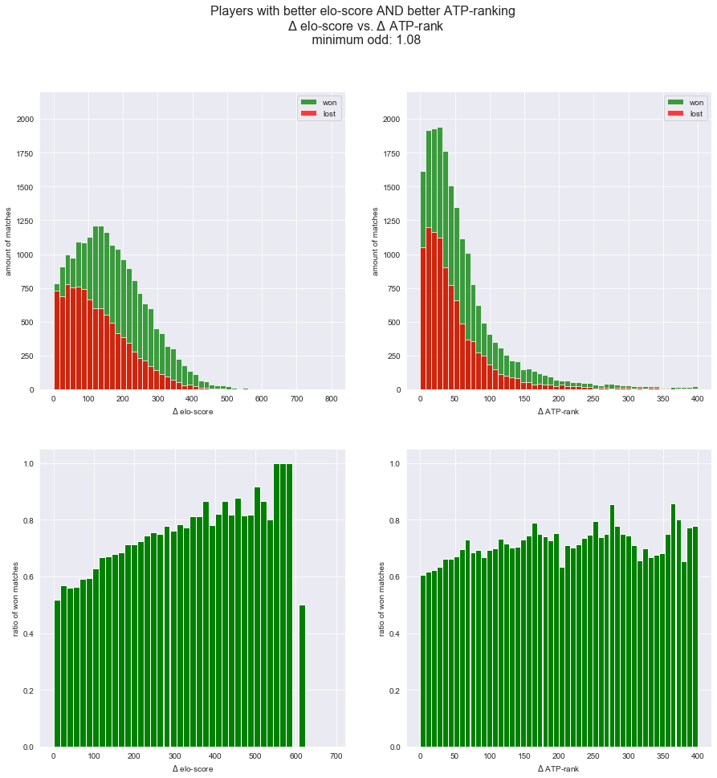

As you see this strategy wouldn't work properly, because very few matches let to bet over years. The ROI including the losses wouldn't look glorious also, I think. 

Let's have look how it is if we only consider matches of the *$1^{st}$ Round*, the differenc between the competitors should be larger. And if a weak player comes to the finals, he had a good run or a lucky week.

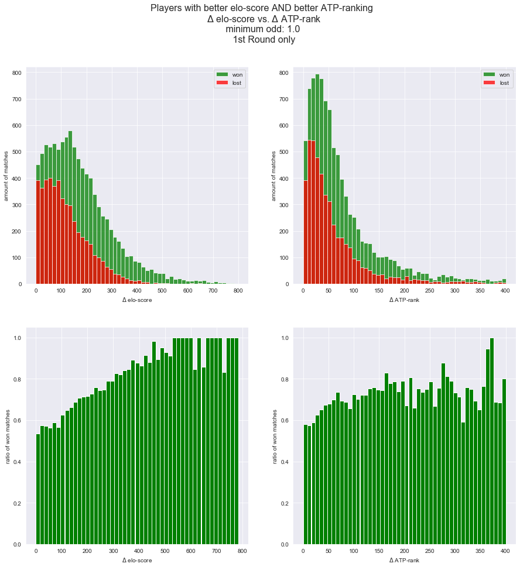

So this look ok, due to the fact that the ratio of won matches is a bit higher than before, **but** we left the minimum odds at 1.0! **And** the total amount of matches decreased, see the scale of the upper graphs.

**Conclusion:** The elo-score is the better indicator than the ATP-ranking. But in the moment it is not sure if it helps us to make profit. We can estimate that a higher elo difference will cause lower odds and also the chance to make profit.(Maybe the ML Model could give us more confidence...)

## Simple strategy?
With the information above we can try to develop a simple strategy to make profit. Of course other Kaggle competitors already have shown, just betting on the favorite / the player with odds of a favorite, does not push the ROI very well. 

But let's have a try by using the differences of the rank and the elo-score... Maybe we find also the underestimated underdogs...

With a numpy meshgrid several constellations of +/- delta elo-score and +/- delta ATP-rank are observed. With pandas the matches are filteres out and the profit calculated. The observations reach over 10 years, from the beginning of 2009 until the end of 2019. 

I look on the strategies if there is a profit at all. In a second step I check if setting a minimum odd makes it better. Finally I check if with tax a possible profit is still there.

The animated development of the ROI according to the strategies with the different parameters are [here](Animated_gifs)

### Strategy: Betting the better
Straight forward, just betting on all matches with at least the shown delta values.

As you see there is no constellation that makes profit. Over a longer time it makes only loss. 

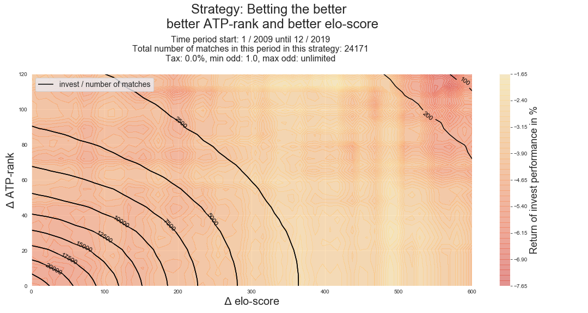

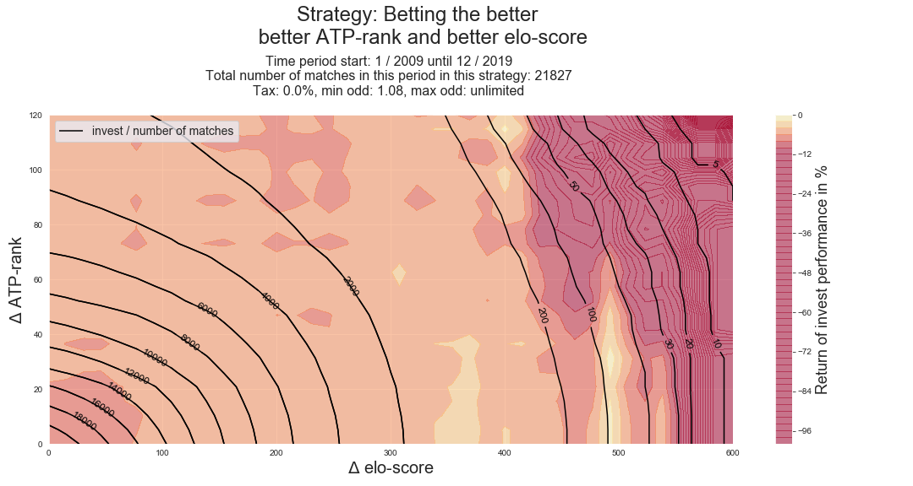

With the attempt to rise the profit and eliminating the lowest odds, that means min_odd = 1.08 makes it worse not better. The high delta elo area is most affected. If we look on the scale we notice that the upper limit rised a bit, that means that there could be areas with profit. 2344 bets fell out that means that nearly 10% of the bets were in the lowes odd area.

Maybe there is a setup of min and max odds where a profit is generated. But this is future work. 

### Strategy: Betting crossover 1
Let's do something else. Just flip one of the features to negative and see what happen. The idea is somehow to pick underestimated underdogs. The odds are influenced by the majority of betters. I don't know which basis they prefer. I don't assume that the majority look on the elo, but maybe some professional betters with high wages. 

Considering the graph with the outvome distribution I would assume that a player is rather overestimated if he has a much better rank. Just look....

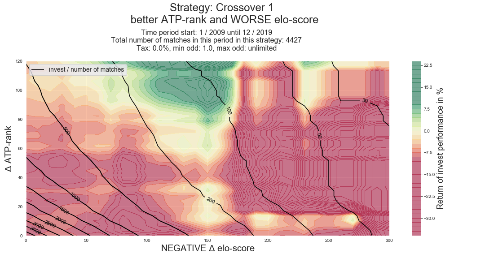

**And there it is!** the profit area with a straight forward strategy. 

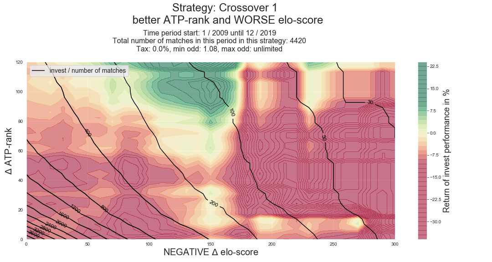

A threshold in the min odds do not make a signifikant effect. Only 7 bets fell out. It means that the majority of bets has quite high odds.. Mybe these are the underdogs we search for where noone else would bet on...

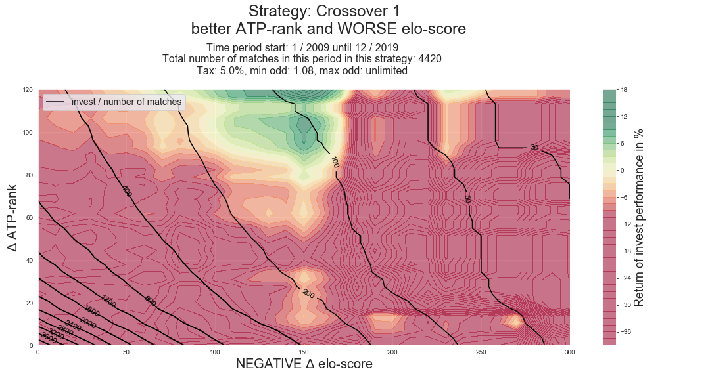

And even the diminution of the profit by the tax does not kick it out! And it seems to work as well over the last 10 years as well over the last 5 years.

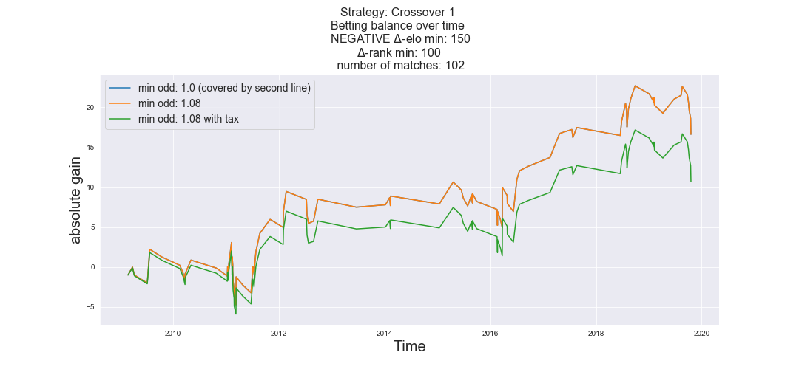
Another interesting aspect of this finding is that **only 44 of the 102 matches were bet right** . 58 bets were lost and the balance is still positive. This differs completely from the Nadal example at the top. It seems to be a funny combination of prediction and high odds.

Nevertheless unfortunately the amount of matches is quite low and it will be hard to figure out exactly such matches in time to bet on it. In the graph you see that there were a bit more that 100 matche in 10 years, that makes about 10 matches a year. And normaly there are over 2000 matches a year. 

**But hey, there is a way!** and if it's not the only strategy it is at least a part of a portfolio of betting strategies! 

### Strategy: Betting crossover 2
So make it the other way, better elo worse rank.

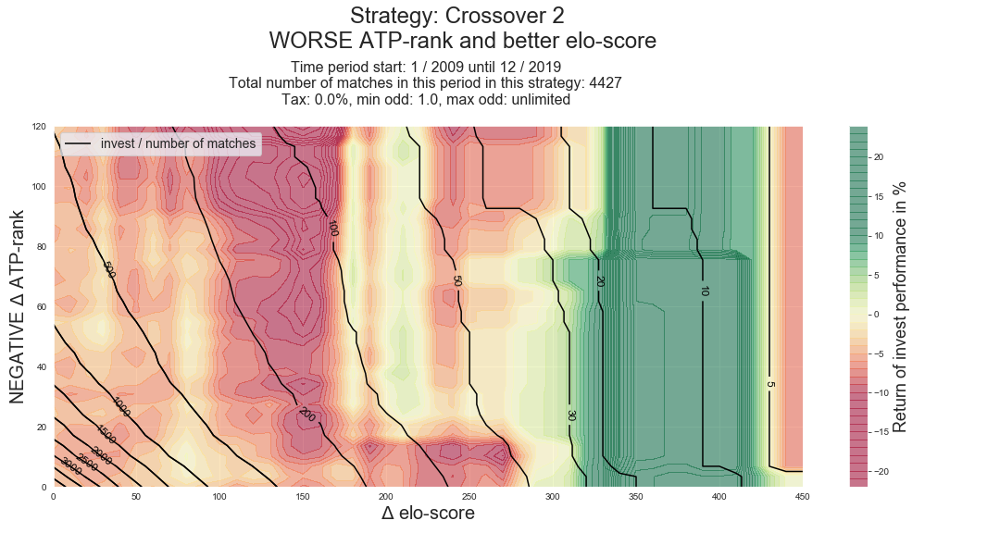

You see that there is a profit area but there much less matches as in the strategy before. 

A slight profit area seems to be around delta elo = 200 but I'm not sur if it could be consistent.

There wer no significant changes with the low odd filter. About 30 bets fell out in the area with lower deltas.

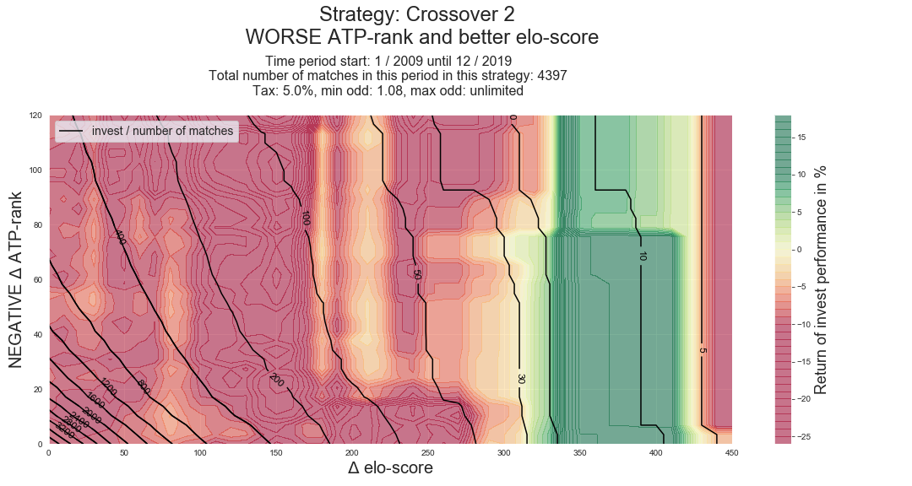

As you see the tax kills this strategy. Maybe the the very few high delta elo could be put in a strategy portfolio.

## Conclusion
As shown there are ways for a more or less simple strategy to make profit. Even if the strategy crossover 1 gives back ony a few matches it is an effort. Further simple analyses considering more the limits of the odds cold maybe discover other profit spots.

# Feature engineering
The previous chapter showed how features can provide help to make a betting decision to make profit. The strategy analyses were a kind of manual decision tree. Let the machine create further decision trees with many more features to find a way to the profit...

Based on the given data several other features can be generated. Some others can be directly one-hot encoded.

We make one sample per player per match. So the machine should decide for each player if he will win or not. The advantage is that the labels are completely balanced and there is no problem with it which player is called first. That avoids the problem that the feature player1 and player2 could have an importance. Now we have player and opponent and flipped in the next sample.

## Past features

These features are created of the data XXX days before the match. All these features are also flipped as the opponent features.

The ***player features*** are set to the past 5 days and describe latest match statistic. 

- playerft_xxx_0: number of won matches
- playerft_xxx_1: number of lost matches
- playerft_xxx_2: number of played matches
- playerft_xxx_3: percentage of victory
- playerft_xxx_4: number of won matches on this surface
- playerft_xxx_5: number of lost matches on this surface
- playerft_xxx_6: number of matches on this surface
- playerft_xxx_7: percentage of victory on this surface

The ***duo features*** describe the statistic how these players matched the last times (maybe they hadn't a common match in the past). The period is set to the last 150 days. 

- duoft_xxx_0: matches against opponent
- duoft_xxx_1: wins against opponent
- duoft_xxx_2: losses against opponent
- duoft_xxx_3: percentage of victory against opponent

The ***general features*** contain reputation data during the last 150 days as rank, elo,...

- generalft_XXX_0: Rank Player 1
- generalft_XXX_1: Rank Player 2
- generalft_XXX_3: diff Rank (- if opponent has lower rank)
- generalft_XXX_4: is the rank the player worse? (1 if yes)
- generalft_XXX_5: elo Player 1
- generalft_XXX_6: elo Player 2
- generalft_XXX_7: difference in elo, if pos. opponent is weaker
- generalft_XXX_8: if 1 player has a higher elo
- generalft_XXX_9: best elo of the player in last X days
- generalft_XXX_10: lowest elo difference as winner
- generalft_XXX_11: highest elo difference as loser

The ***recent features*** gives the performance in the latest matches. Even if most of these features look on the last match the period is also 150 days.

- recentft_xxx_0: Days since last match
- recentft_xxx_1: was the last match won?
- recentft_xxx_2: Ranking of the player in the last match
- recentft_xxx_3: number sets best_of of the last match
- recentft_xxx_4: number of won sets in the last match
- recentft_xxx_5: 0 if player retired in the last match
- recentft_xxx_6: has player retired in the past?
- recentft_xxx_7: Ranking of the opponent in the last match
- recentft_xxx_8: elo-score of the player in the last match
- recentft_xxx_9: elo-score of the opponent in the last match
- recentft_xxx_10: elo-difference in the last match

The number of days can be seen as **hyper-parameter** for the features. Changing the value could possibly bring a benefit. Additionally we could make the features for several time periods, possibly a tendency of the fitness or performance of a player can be discovered.

The creation of these features takes a lot of computational time so that just playing around with it is not easy. For furture-work the algorithm could be revised and mayby accelerated. At least the feature blocks should be run in parallel for time saving.

## One-hot features
The initial features "Series", "Court", "Surface", "Round", "Best of", "Tournament" were converted to encoded bool features. 
The player names were also one-hot encoded. For each outcome the name of the player and the name of the opponent.

## Missing values
Due to the fact that some past features are not applicapable everytime some features produce missing values. So if a player had no matches durching the last few days the ratio of won matches e.g. is a NaN. Set it to 0 is not suitable because it would be a false information. Especially in the *duo_features*, that means the direct comparison of the players, contain many missing values. The chance that exactly these players matched each other in the rather short time period inspected (150 days) is low. Of course it can be discussed if such features are useful at all. But I would say that they are at least not useless...

# Prediction with XGBoost
The attempt is to predict the outcomes right and increase the ROI.
The decision to use XGBoost is based the fact that it can handle missing values. The missing values were generated in the features. So the features are not ready to use in an ANN or AdaBoost with trees or forests.

(To make it short: I didn't find a predictive model for long term gain yet...)

## Models
It figured out that the XGB models is very very sensitive to the train data. A slight variation of the train and eval data gives complete different scores and also the predictions of the test set is different. Due to this I used several equal models but with slightly different train data. So in this cas it is an ensemble of 9 XGB models with the hope that their common opinion will rise the ROI.

I played with some parameters, especially *learning rate, max_depth* and *early stopping*, on the one hand to increse the precision and the ROI on the other hand to avoid overfitting. I observed that better train loss often has a worse eval loss. That means that there remained a lot of work... I assume that it depends on the XGB-parameters but maybe also on the features.

## Split the data
The data is split to a train set, an eval set and a test set. The reference point is the start date of testing. A few hundred samples before a used as eval set and several thousend samples befor the eval set is used as train set. A few hundred after this point are used for testing.

The different models are trained with slightly different train and eval sets. For that there is a variation of the lenght of the eval set (the differences are in the range +/- 70)

## Loss function / scorer
On the one hand we want to predict the right outcome. Especially we want to decrease the amount of *false positive* predictions so the *error* (1-accuracy) could be an appropriate scorer to minimize. (Until now in test runs the eval error was above 0.3 that means that right predictions were below 70%. Afterwarts calculated ROI was negative...)

On the other hand we want to maximize the ROI / gain. So I implemented a scorer that calculates the absolute gain of the predictions according to the odds. Due to the fact that we use a gradient **decent** method the has to be flipped to negative, because XGB wants to minimize the score. The problem is that there is no chace to pass the odds to the function. It is not possible to extract the odds as feature from the passed DMatrix. For each run the scorer function has to be created new according to the train/eval/test set with the odds as constant values in it. In the scorer a kind of thershold also can be set as hyperparameter. 

Due to the fact that each match has two samples both outcomes are treated as unique matches. I observed in test runs that sometimes the prediction for both outcomes is high (above 0,5). For that they are compared and lower one is set to 0 and the higher one passed as it is.

## Voting systems
Due to the fact that the XGB models are so instable and different in their results a voting system is required and also a strategy how to compute the confidence.
Several systems are implemented.

### Confidence
How to make the confidence for the decision? There are a some different attempts to built a confidence.
- Straight probability. Just take the probabilities of the predictors `conf=proba`.
- Confidence by the odds. Division of the probabilities by the odds  `conf=proba/odd`. It's a kind of confirmation of the opinion. If the odd is low (towards 1) and the proba high the confidence will rise. If the odd rises (lower confidence of the bookmaker / other betters) the confidence decreases.
- Log_odd confidence. The idea is to punish the probas by the odds so that the predictors have to be very sure to make a decision. `conf=log10(odd)*(10**(proba))` Assuming that if there are higher odds the probas won't be as high. It also avoids that the majority of decisions won't bet on matches with low odds where also the gain is low and the chance/risk balance isn't very good.

### Voting
For the common opinion/decision according to the above mentioned confidences of the models here are:
- The mean of the confidences of the models. Then check if the mean if above the threshold.
- Majority voting. Count how many modles confidence is above the threshold. The amount of confident models is also a hyperparameter. Due to this the amount of models is not even.

Note: The different confidence starategies may need different thresholds.

### Prediction and results
Some model setups were run. The testing ran over a longer time (begin of 2014 until end of 2016) in chunks of 500 matches as test data starting each month. The train and eval sets were split as described above according to the test start data. 

The following is only one setup. It is the one that has at least a positive profit in the end even it is not really satisfactory. Other results are [here](gxb_results_summary.md)

### Conclusion
As you see the results are not satisfactory yet. At the moment it is still a kind of gambling instead of a proper predictive model for permanent making money. I'm sure that there is a way but an amount of research remained to find it.

# Future work
There are several points that can be improved for better results:

- calculate surface dependent elo-scores
- handling of np.nan in player rank
- maybe improve the fucntion for the elo-score
- parallelize the calculation of the features for accelerated computation and playing with the hyperparameters in the features.
- Try XGBmodels without odds in the features. The feature importance of the odds seems to be quite high so they have a large influence on the decisions. But the odds gives back the opinion / confidence of the bookmaker and other betters. I think it would be better to make an own opinion without the influence of the odds. Or maybe at least a combination of it in an ensemble that some models calculte with odds and others without and then check the voting.
- Find a way to handle the missing values un the generated features for usage with other predictors that do not accept NaNs. Then try ANN, Random Forests e.g. maybe with other boosters.
- Improve the precision. Check if the gain as loss function is the expediant way.
- Work / optimization of confidence calculation.
- Improve the voting system
- Filtering *samples* of best players and best tournament right before the model training and not only drop the *one-hot features*.
- Maybe implement a kind of gridsearch for the models to figure out better parameters. Due to the split and the scorer it won't be as easy.
- Redesign the whole system to make only one sample per match and let the model directly decide who wins.
- Voting by another model as transfer learning (ANN?)

